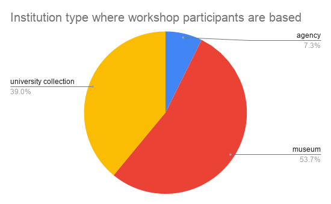
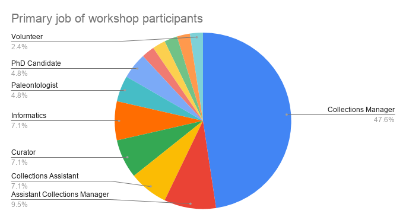
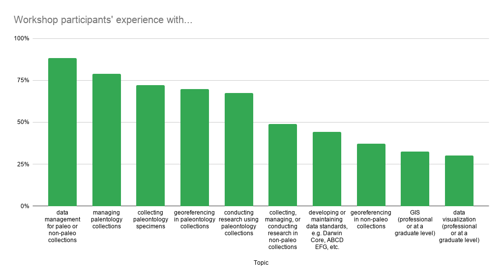
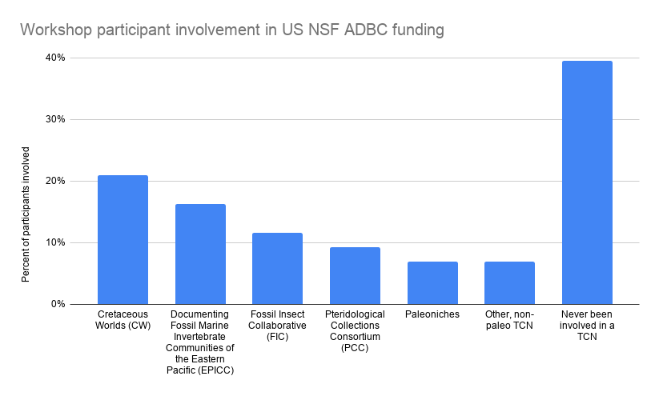

## Georeferencing for Paleo: Refreshing the approach to fossil localities

As the United States paleo collections community wraps up funding on several [Thematic Collections Networks](https://www.idigbio.org/content/thematic-collections-networks) we recognize that a significant amount of digitization work remains to be done and that georeferencing is one of the next big roadblocks, both within the US and for our colleagues around the world. Across all collection types, there are major issues with the quality of georeference data currently available on biodiversity data aggregators such as iDigBio and GBIF. For paleo collections, there are additional issues related to applying existing georeferencing workflows in the paleontological context, as well as to sharing georeference data publicly. This workshop will take advantage of the momentum catalyzed by funding in the US paleontological collections community to address critical issues related to georeferencing workflows and georeferencing data quality.

This workshop is sponsored by [iDigBio](https://www.idigbio.org/), hosted by the [Natural History Museum of Utah](https://nhmu.utah.edu/), and organized by Carrie Levitt-Bussian (Natural History Museum of Utah), Holly Little (Smithsonian National Museum of Natural History), Talia Karim (University of Colorado Boulder), Erica Krimmel (iDigBio), and Deborah Paul (iDigBio). Please see the [workshop wiki page](https://www.idigbio.org/wiki/index.php/Georeferencing_for_Paleo_Workshop) for additional information about attendee logistics. _**Due to coronavirus, this workshop is now entirely virtual!**_

### Goals and Outcomes

_**Note that in the modified virtual version of this workshop we are focusing on information gathering aspects of the goals & outcomes below. Future activities will address the full scope of our original intent.**_

This workshop will take advantage of the momentum catalyzed by funding in the US paleontological collections community to address critical issues related to georeferencing workflows and georeferencing data quality. The workshop will:
1. **Address the lack and poor quality of specimen georeference data shared on biodiversity aggregators**, e.g. the iDigBio Portal or GBIF, by determining recommendations for the paleo collections community on best practices and workflows for generating and sharing this data.
1. **Identify technical barriers to implementing** these recommendations and discuss a strategy for communicating them to standards organizations, aggregators, collection management software solutions, and georeferencing software tools.
1. **Disseminate the findings of this workshop widely, both within the paleo collections community (including to collectors) and as a resource discoverable by other domains**. Findings will include a “toolkit” to share the recommendations on best practices and workflows determined by this workshop.

### Planned Activities

- Host two listening sessions with workshop participants ahead of time to design the agenda unconference-style. _(pre workshop)_
    - [listening session discussion prompts](2020-workshop/Georeferencing-for-Paleo-Listening-Session-Intro_2020-01-29.pdf)
    - [listening session summary](2020-workshop/Georeferencing-for-Paleo-Listening-Sessions-Summary_2020-01-29.pdf)
    - [summary of challenges](2020-workshop/Georeferencing-for-Paleo-Challenges-Summary_2020-01-29.pdf)
- Review the current quantity and quality of georeference data available for paleo specimens that are mobilized on aggregators, and of use cases for this data in the literature. _(pre workshop)_
- Review the currently available georeferencing workflows, e.g. those produced by TCNs including non-paleo TCNs. _(pre workshop)_
    - See resources collected in [Workflows](workflows).
- Report on and discuss the quantity and quality of georeference data available for paleo specimens that are mobilized on aggregators; Identify key issues concerning data quality and/or standards, as well as potential solutions for resolving these issues.
    - EK
- Review current best practices for georeferencing, including but not limited to those described in the updated version of the “Guide to best practices for georeferencing” (Chapman & Wieczorek, 2006), which should be available by spring 2020.
    - See resources collected in [Standards](standards).
- Discuss challenges and solutions specific to georeferencing paleo specimens and to sharing georeference data for paleo specimens, e.g. those related to regulations on masking coordinates.
- Share novel georeferencing workflows developed by participant institutions.
    - See resources collected in [Workflows](workflows).
- Introduce local GIS community experts to the data and processes involved in georeferencing paleo specimens, and create opportunities for them to share their expertise with us.
- Build on the existing work of the [iDigBio Georeferencing Working Group](https://www.idigbio.org/wiki/index.php/Georeferencing_Working_Group) to establish a concept for comparing and sharing locality information and georeferencing data across institutions, e.g. via a locality registry/service.
- Determine recommendations for the paleo collections community on best practices and workflows for generating and sharing georeference data.
- Discuss challenges to implementing these recommendations, both technical and social, as well as who is in a position to address these challenges.
- Disseminate the findings of this workshop: (1) via meetings and webinars hosted by the [iDigBio Paleo Data and Digitization Working Group](https://www.idigbio.org/wiki/index.php/Paleo_Digitization_Working_Group), (2) via collaboration with the [TDWG Earth Sciences and Paleobiology Interest Group](https://github.com/tdwg/esp/), (3) online, in a versionable format where possible, (4) as a manuscript or white paper to share recommendations with the broader collections community, possibly to publish in BISS or RIO. _(post workshop)_

### Workshop Agenda

_**Times below are listed in Salt Lake City, Utah, United States local time (MDT). Virtual conference sessions are being held via Zoom.**_

Some essential links for this workshop...
- Collaborative notes document: [https://bit.ly/3eEpkag](https://bit.ly/3eEpkag)
- Tips for using Zoom: [https://bit.ly/2wV6j2v](https://bit.ly/2wV6j2v)
- Virtual workshop participant introductions: [https://bit.ly/2wXvO3a](https://bit.ly/2wXvO3a)
- Shared workshop content: [https://tdwg.github.io/esp/georeferencing/workflows](https://tdwg.github.io/esp/georeferencing/workflows) (this site)
- Workshop logistics wiki: [http://bit.ly/SLC-geo-paleo](http://bit.ly/SLC-geo-paleo)
- [Post-workshop feedback survey](https://fsu.qualtrics.com/jfe/form/SV_5oJ3Wxt3j2RPBn7)

#### Pre-Workshop

Workshop participants are contributing (April 6-17, 2020) and reviewing (April 21-28, 2020) content asynchronously prior to the virtual workshop. This content is collected on the site here.

#### Tuesday, April 28, 2020

_What standards do we have for georeference data and how we are currently using them?_

| Time | Length | Topic | Presenter |
| --- | --- | --- | --- |
| 09:00am MDT | 10 min | [Introduction]() | [Talia Karim](https://orcid.org/0000-0001-6514-963X) |
| | 20 min | [Presentation]() | [Holly Little](https://orcid.org/0000-0001-7909-4166) |
| | 20 min | [Exploring Existing Aggregator Data, Parts 1 & 2](https://ekrimmel.github.io/paleo-georeferenced-data/georef4paleo) | [Erica Krimmel](https://orcid.org/0000-0003-3192-0080) |
| | 40 min | Group discussion | moderators |

#### Wednesday, April 29, 2020

_What georeferencing best practices, and documentation for implementing these best practices, already exist?_

| Time | Length | Topic | Presenter |
| --- | --- | --- | --- |
| 09:00am MDT | 10 min | [Introduction]() | [Talia Karim](https://orcid.org/0000-0001-6514-963X) |
| | 20 min | [Presentation]() | [Holly Little](https://orcid.org/0000-0001-7909-4166) |
| | 20 min | [Exploring Existing Aggregator Data, Part 3](https://ekrimmel.github.io/paleo-georeferenced-data/georef4paleo) | [Erica Krimmel](https://orcid.org/0000-0003-3192-0080) |
| | 40 min | Group discussion | moderators |

### Workshop Results

#### Who participated in this workshop?

